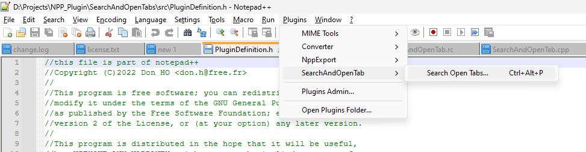
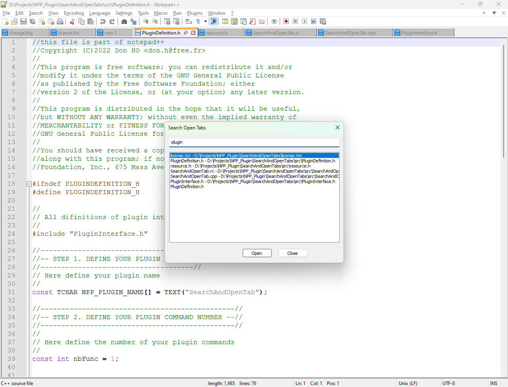

# SearchAndOpenTab - Notepad++ Plugin

## Project Vision & Goal
Notepad++ Plugin that provides a keyboard-driven interface for searching and switching between all currently open editor tabs. The goal is to improve workflow efficiency, especially for users managing many open files.

## Features
- **Quick Invocation:**
  - Accessible from the Notepad++ Plugins menu as "Search And Open Tabs"
  - Default keyboard shortcut: <kbd>Ctrl</kbd>+<kbd>Alt</kbd>+<kbd>P</kbd> (or similar)
- **Native Modal Dialog:**
  - Titled "Search Open Tabs"
  - Stays in focus until a tab is selected or dialog is closed
  - Edit control (text input) auto-focused for instant typing
  - Scrollable list box showing open tabs
  - Closeable via [X], <kbd>Esc</kbd>, or a "Close" button
- **Tab Listing:**
  - Shows all open files (filename and full path)
  - Handles duplicate filenames and unsaved files (e.g., "new 1")
- **Search & Ranking:**
  - Case-insensitive, name matching against full file path
  - Instant filtering as you type
  - "No matching tabs found" message if no results
- **Keyboard & Mouse Navigation:**
  - <kbd>Up</kbd>/<kbd>Down</kbd> to navigate
  - <kbd>Enter</kbd> or double-click to activate tab
  - Single-click to select
  - Closing dialog returns focus to Notepad++

## Screenshots

### Plugin Dialog

### Plugin Menu Option and Shortcut

## How to Install
1. **Build or Download the DLL:**
   - The plugin builds to `SearchAndOpenTab.dll` (e.g., from `vs.proj/SearchAndOpenTab/x64/Debug/SearchAndOpenTab.dll`)
2. **Copy the DLL:**
   - Place `SearchAndOpenTab.dll` into the `plugins` folder of your Notepad++ installation directory (e.g., `C:\Program Files\Notepad++\plugins\`)
   - (Optional) Create a subfolder named `SearchAndOpenTab` and place the DLL inside it for better organization: `C:\Program Files\Notepad++\plugins\SearchAndOpenTab\SearchAndOpenTab.dll`
3. **Restart Notepad++:**
   - Close and reopen Notepad++ to load the new plugin.

## How to Use
1. **Open the Plugin:**
   - Go to the `Plugins` menu and select `Search Open Tabs...`
   - Or use the keyboard shortcut: <kbd>Ctrl</kbd>+<kbd>Alt</kbd>+<kbd>P</kbd> (or as configured)
2. **Search Tabs:**
   - Start typing in the dialog to filter open tabs using fuzzy search
   - Use <kbd>Up</kbd>/<kbd>Down</kbd> to navigate, <kbd>Enter</kbd> or double-click to activate
3. **Close the Dialog:**
   - Press <kbd>Esc</kbd>, click [X], or use the "Close" button

## Edge Cases & Error Handling
- If no files are open, the list will display "No files are open."
- If no search results, the list will display "No matching tabs found."

## Compatibility & Technology
- Written in C++ (Visual Studio 2019+)
- Uses the official Notepad++ Plugin SDK
- Native Win32 API for UI
- Delivers a single DLL: `SearchAndOpenTab.dll`

## License
See [license.txt](license.txt)